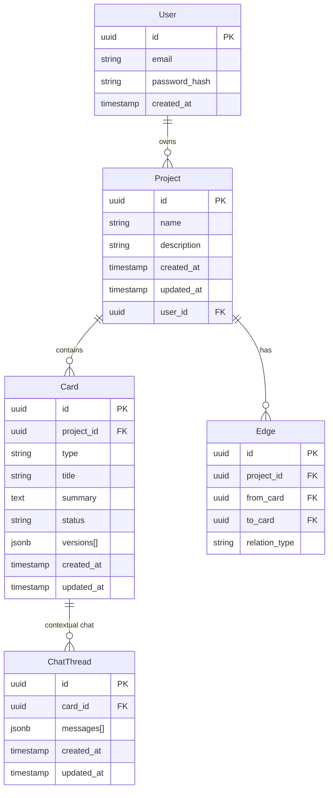

# 🏗️ Architecture Specification — PiStack (MVP)

## 1. Visão Geral
- **Frontend:**
  - Next.js (App Router) → SSR/SSG + rotas API leves
  - React Flow (Canvas A) + tldraw (Canvas B, experimental)
  - TailwindCSS → estilização rápida
  - Radix UI / shadcn → componentes acessíveis

- **Backend:**
  - Supabase (Postgres + pgvector) → DB principal
  - Auth → Supabase Auth (email/password)
  - Storage → Supabase (arquivos, snapshots)
  - Prisma ORM → schema consistente, migrações versionadas

- **IA Layer:**
  - OpenAI GPT-5 API → geração/refino de cards
  - LangChain (opcional) → gerenciamento de contexto
  - Chat por card → threads isoladas no DB

- **Infra:**
  - Vercel → deploy frontend + rotas API
  - Railway/Render (backup) → backend persistente futuro

---

## 2. Modelo de Dados



---

## 3. Fluxos Técnicos

### 3.1 Criação de Projeto
1. User → `POST /api/projects` → Supabase `projects`
2. Se template → API gera cards default (`cards`, `edges`)

### 3.2 CRUD de Card
- **Create:** `POST /api/cards` → insere em `cards`
- **Update:** inline → `PATCH /api/cards/:id` (autosave <1s)
- **Delete:** `DELETE /api/cards/:id`

### 3.3 Conexões (Edges)
- `POST /api/edges` → cria relação `from → to`
- Cor/estado controlado no FE; persistência no DB

### 3.4 Chat Contextual
1. User input → `POST /api/cards/:id/chat`
2. Backend → chama OpenAI API
3. Resposta → salva em `chat_threads.messages`
4. Apply → `PATCH /api/cards/:id` atualiza resumo + gera `version`

### 3.5 Export Markdown
1. User → `GET /api/projects/:id/export`
2. Backend → compila cards + edges → `.md`
3. Retorna arquivo p/ download

---

## 4. Estrutura de Pastas

```
/app
  /projects
    [id]/page.tsx        → Canvas
    new/page.tsx         → Novo projeto
  /api
    /projects            → CRUD project
    /cards               → CRUD cards
    /edges               → CRUD edges
    /chat                → IA endpoint
/lib
  db.ts                  → Prisma client
  openai.ts              → IA client
/components
  Canvas.tsx
  Card.tsx
  ChatPanel.tsx
  Sidebar.tsx
  TemplatePicker.tsx
/docs
  prd.md
  architecture.md
  ux/
    ux-spec.md
  epics/
  stories/
```

---

## 5. Decisões Arquiteturais (ADRs)
1. **DB:** Supabase Postgres (pgvector para IA se necessário)
2. **Canvas:** React Flow (MVP) / tldraw (exploração)
3. **Autosave:** debounce 800ms → `PATCH`
4. **Versionamento:** cada apply → novo item em `versions[]`
5. **IA:** server-side only (nunca expor chave no cliente)
6. **Export:** Markdown no MVP
7. **Histórico:** limite de 20 mensagens por card

---

## 6. Riscos Técnicos
- **Latência IA:** limitar tokens/respostas curtas
- **Canvas Performance:** React Flow OK até ~200 nodes → avaliar fallback tldraw
- **Lock-in Supabase:** mitigado com Prisma ORM
- **Custo IA:** monitorar requisições; rate limiting
